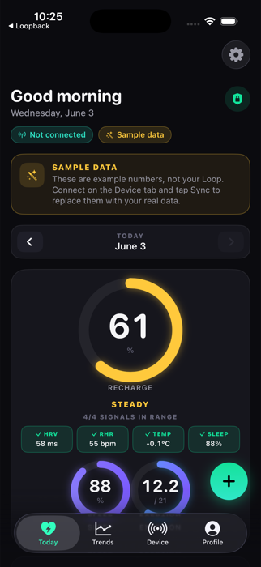
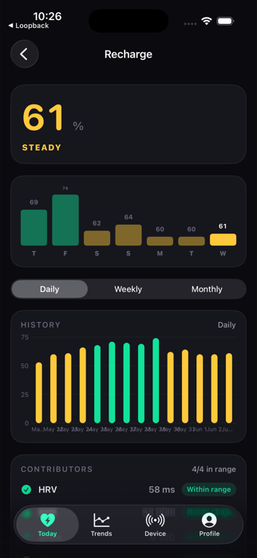
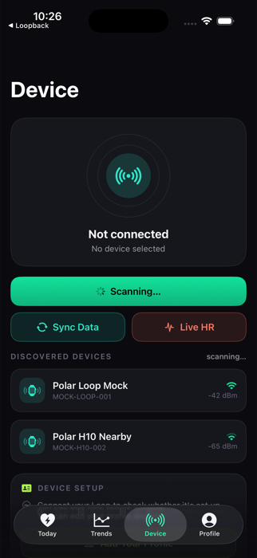
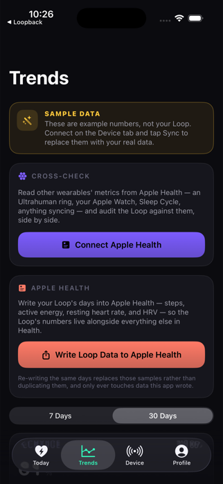
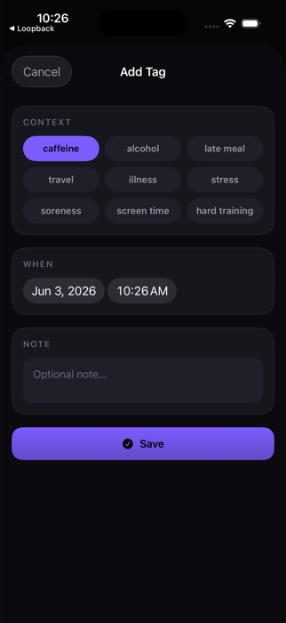
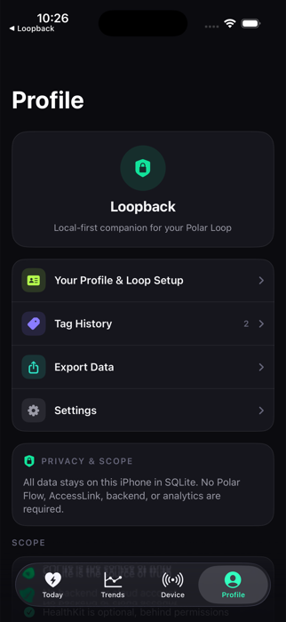

# Loopback

A private companion app for the Polar Loop band. Loopback connects to your Loop over Bluetooth and
shows your activity, sleep, heart rate, and recovery in a clean dashboard — and **everything stays on
your phone**. No account, no cloud, no tracking.

> Wellness and informational use only — Loopback is not a medical device.

<p align="center">
  
  
  
</p>
<p align="center">
  
  
  
</p>

## What it does

- **Today** — your day at a glance: a Recharge ring (how recovered you are) plus Sleep and Exertion,
  with sleep stages, heart rate, and key vitals. Tap any card to dig in.
- **Detail screens** — every metric opens to a 7-day view, daily/weekly/monthly history, and a
  plain-English explanation of what it means.
- **Your device** — find and connect your Loop, check battery, and watch live heart rate.
- **Tags** — jot down context (caffeine, travel, illness…) and see how it lines up with your numbers.
- **Compare** — if you use other wearables that sync to Apple Health (Apple Watch, Ultrahuman, Sleep
  Cycle…), pick any of them and check your Loop against them side by side.
- **Export** — get your data out anytime as JSON or CSV.

## Try it without a Loop

Loopback comes preloaded with a month of realistic sample data, so you can explore the whole app in
the iOS Simulator with no hardware. As soon as a real Loop connects, the sample data is replaced with
yours.

## Build it yourself

Requires Xcode 26+ and iOS 17+. Open `Loopback.xcodeproj`, pick an iPhone simulator, and press Run —
dependencies download automatically. From the command line:

```bash
xcodebuild -project Loopback.xcodeproj -scheme Loopback \
  -sdk iphonesimulator -destination 'platform=iOS Simulator,name=iPhone 17 Pro' build
```

To run on your own iPhone, set your Apple Developer team and a unique bundle id under **Signing &
Capabilities** in Xcode.

## Privacy

Your data is stored only on your phone (a local SQLite database). No backend, no account, no
analytics. Apple Health is optional and used only if you grant permission.

## Contributing

PRs welcome — see [AGENTS.md](AGENTS.md) for how the app is built and the conventions to follow.

## License

[MIT](LICENSE). The Polar BLE SDK is a separate dependency under its own license.

> Loopback is an independent project and is not affiliated with or endorsed by Polar.
